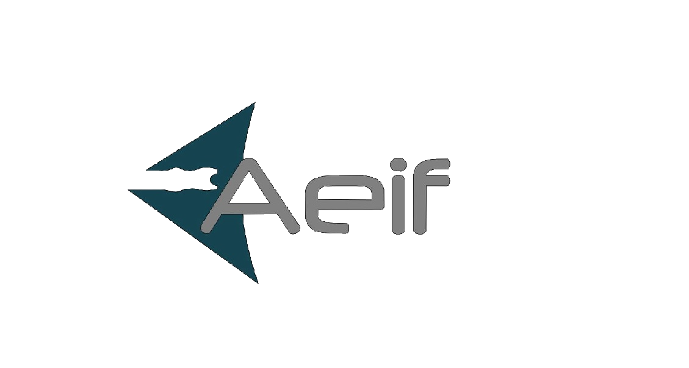

# Bonjour !
</img>
Bienvenue sur le profil GitHub de l'AEIF, l'Association des Étudiants en Informatique du Futuroscope.

## Nous rejoindre
Pour profiter des boissons chaudes ☕ et de la bonne ambiance sur le campus, vous pouvez devenir adhérent et nous rejoindre via une inscription sur <a href="https://www.helloasso.com/associations/aeif/adhesions/inscription-aeif">ce lien</a> ou en venant nous voir dans le local de l'association. 

## Participer
Nous avons mis en place un répertoire communautaire accessible via <a href="https://github.com/AEIF-Poitiers/Community">ce lien</a> dans lequel nous vous invitons à partager vos projet! Plus d'informations à ce sujet sur le README du répertoire.

## Le bureau 

<table align="center">
    <tr>
        <th> Prénom
        <th> Nom
        <th> Rôle
    <tr>
        <td> Alexis     
        <td> Louail
        <td> Président
    <tr>
        <td> Louis
        <td> Leenart
        <td> Vice-Président
    <tr>
        <td> Vincent
        <td> Commin
        <td> Trésorier
    <tr>
        <td> Thomas 
        <td> Luneteau
        <td> Vice-Trésorier
    <tr>
        <td> Audrey
        <td> Fauveau 
        <td> Secrétaire
    <tr>
        <td> Thibaut
        <td> Cailleteau 
        <td> Vice-Secrétaire
    <tr>
        <td> Jade
        <td> Rowley
        <td> Resp. Communication et évènementiel
</table>

## Contact
Pour nous contacter, vous pouvez soit : 
- Venir nous voir dans le local sur le campus du Futuroscope (IFMI H6).
- Nous rejoindre sur <a href="https://discord.gg/7AvTvHK">Discord</a>.
- Nous envoyer un mail à <a href="mailto:aeif@protonmail.com">aeif@protonmail.com</a>.
- Sur <a href="https://www.facebook.com/aeif.futuroscope">Facebook</a>.